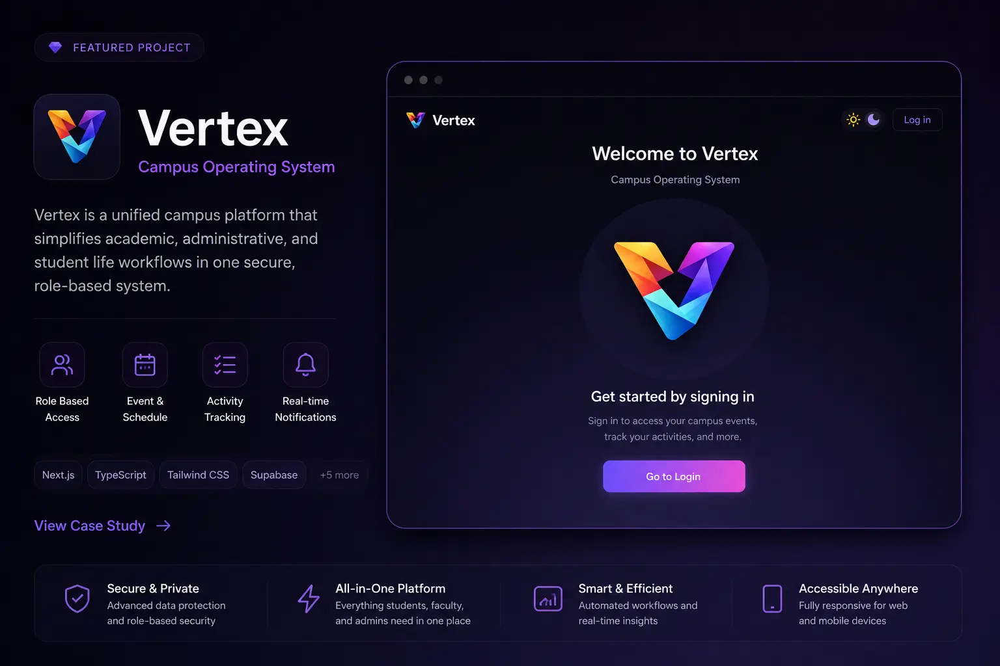
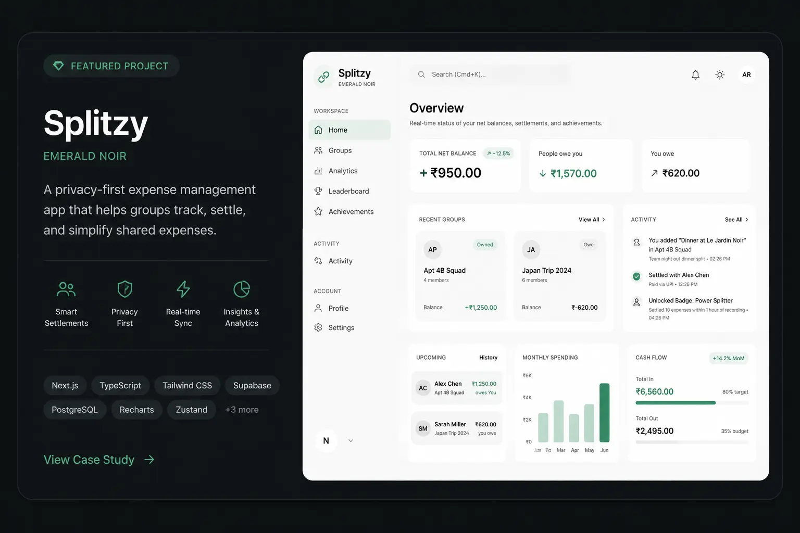
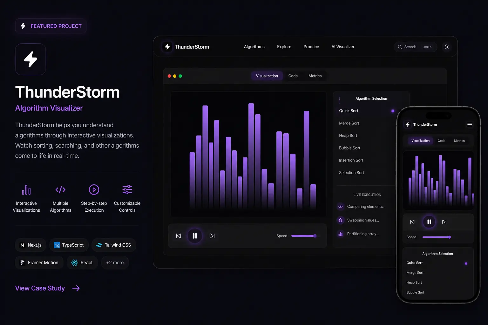
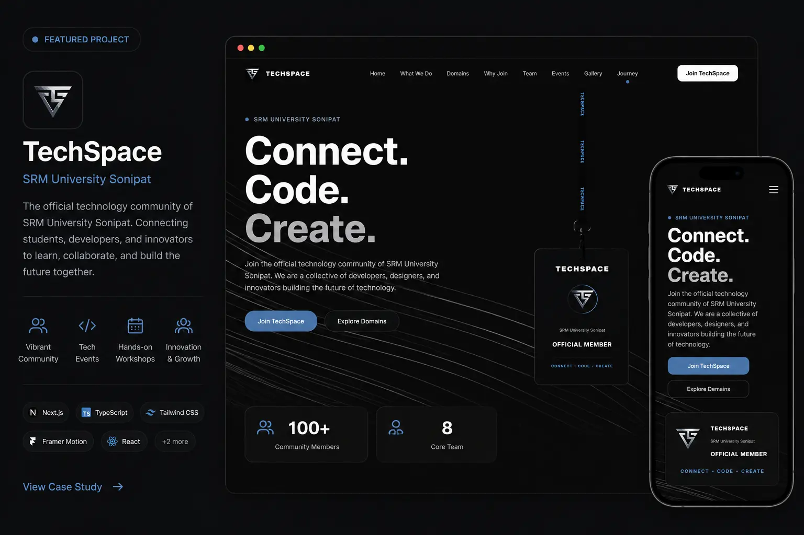
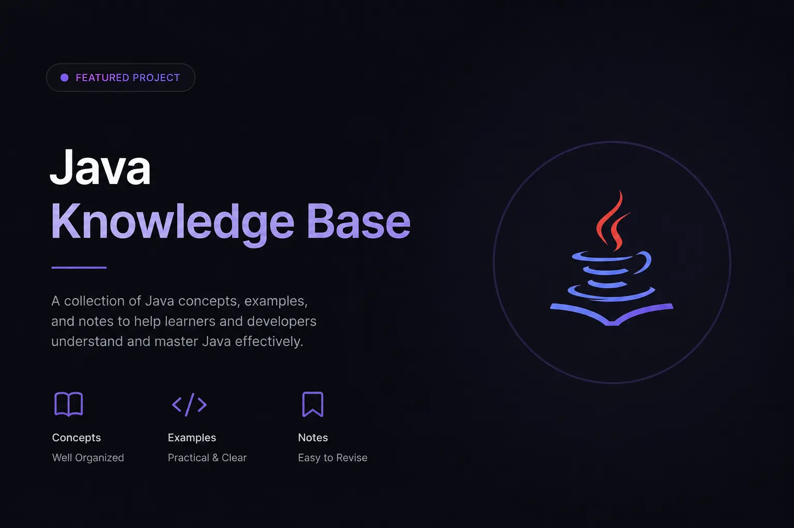

### 01 / INTRO

**Building real things. Learning systems from the ground up.**

Second-year CSE student shipping production software, not tutorial clones — campus infrastructure, fintech-grade architecture, and dev tooling used by real people.

<p align="left">
  <a href="https://harshwardhanportfolio.vercel.app/"> Portfolio</a> &nbsp;·&nbsp;
  <a href="https://github.com/harshwardhan1507"> GitHub</a> &nbsp;·&nbsp;
  <a href="https://www.linkedin.com/in/harsh-wardhan-singh-cse/"> LinkedIn</a> &nbsp;·&nbsp;
  <a href="mailto:harshwardhansingh1507@gmail.com"> Email</a>
</p>

---

### 02 / ABOUT

```ts
const harsh = {
  alias: "Haruto",
  building: "Vertex — Campus OS",
  learning: ["DSA", "System Design", "Backend"],
  openTo: ["Internships", "Freelance", "Collabs"],
};
```

---

### 03 / STACK

#### Languages
 Java &nbsp;&nbsp;  TypeScript &nbsp;&nbsp;  JavaScript &nbsp;&nbsp;  Python

#### Frontend
 Next.js &nbsp;&nbsp;  React &nbsp;&nbsp;  Tailwind &nbsp;&nbsp;  GSAP &nbsp;&nbsp;  Framer Motion

#### Backend / Data
 Node.js &nbsp;&nbsp;  Supabase &nbsp;&nbsp;  PostgreSQL &nbsp;&nbsp;  Firebase &nbsp;&nbsp;  Drizzle ORM

#### Tools
 Git &nbsp;&nbsp;  GitHub &nbsp;&nbsp;  Vercel &nbsp;&nbsp;  IntelliJ

---

### 04 / SELECTED BUILDS

####  [VERTEX ↗](https://vertexcampusos.vercel.app/)
<a href="https://vertexcampusos.vercel.app/">
  
</a>

Campus operating system for Indian colleges — 10 modules, 5 user roles, real deployment.

`Next.js` `TypeScript` `Supabase` `Firebase` `Capacitor`

<br />

####  [SPLITZY ↗](https://harshwardhanportfolio.vercel.app/projects/splitzy)
<a href="https://harshwardhanportfolio.vercel.app/projects/splitzy">
  
</a>

UPI-native expense-splitting PWA. CQRS-lite event sourcing, paise-precision money handling, 5-person team.

`Next.js 15` `Supabase` `Drizzle ORM` `PowerSync`

<br />

####  [THUNDERSTORM ↗](https://github.com/harshwardhan1507/Thunderstorm)
<a href="https://github.com/harshwardhan1507/Thunderstorm">
  
</a>

Algorithm visualizer with a generator-based step architecture for true step-by-step execution.

`Next.js` `Zustand` `GSAP` `Framer Motion`

<br />

####  [TECHSPACE ↗](https://github.com/harshwardhan1507/techspace)
<a href="https://github.com/harshwardhan1507/techspace">
  
</a>

Neo-brutalist website for SRM's student innovation lab, with GSAP scroll-pinned storytelling.

`Next.js` `GSAP` `TypeScript` `Tailwind`

<br />

[→ VIEW ALL PROJECTS](https://github.com/harshwardhan1507?tab=repositories)

---

### 05 / JAVA

####  [JAVA KNOWLEDGE VAULT ↗](https://github.com/harshwardhan1507/Java-Knowledge-Base)
<a href="https://github.com/harshwardhan1507/Java-Knowledge-Base">
  
</a>

Runnable IntelliJ code + Obsidian notes covering Java from fundamentals to advanced concepts.

`ch01` → `ch17`

---

### 06 / CURRENTLY

| | |
|---|---|
|  **BUILDING** | Vertex, Splitzy |
|  **LEARNING** | DSA · Backend · System Design |
|  **LOOKING FOR** | Dev Internship |

---

### 07 / PRINCIPLE

> **Build real things. Not tutorial clones.**

---

### 08 / COMMUNITY

**People who follow the work**

[](https://github.com/harshwardhan1507?tab=followers)

---

<p align="center">
  <b>Harsh Wardhan · Haruto</b><br/>
  <a href="https://harshwardhanportfolio.vercel.app/">Portfolio</a> · <a href="https://github.com/harshwardhan1507">GitHub</a> · <a href="https://www.linkedin.com/in/harsh-wardhan-singh-cse/">LinkedIn</a>
</p>
